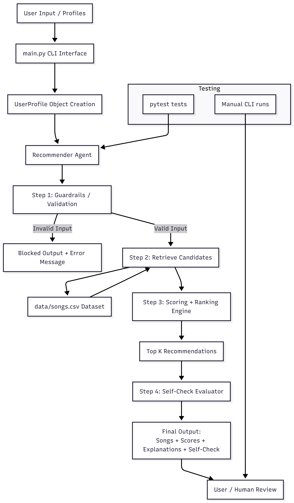
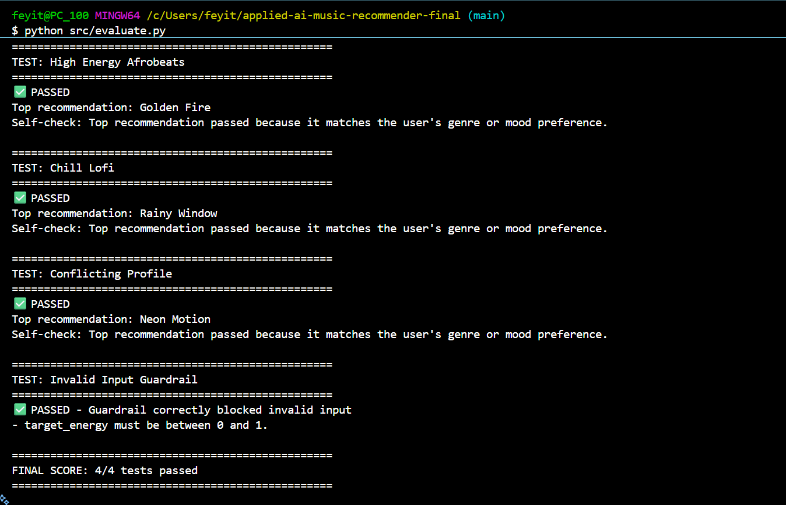

# 🎧 VibeAgent AI Music Recommender

## Original Project (Module 3)
This project is based on my earlier **Music Recommender Simulation** from Module 3.  
The original system focused on recommending songs using simple scoring rules based on genre, mood, and energy.

In this final version, I extended it into a **full applied AI system** by adding an agent workflow, guardrails, and evaluation steps.

---

## Title & Summary
VibeAgent is an AI-powered music recommender that generates personalized song suggestions based on user preferences.

It matters because it demonstrates how AI systems:
- Process user input
- Apply reasoning
- Generate explanations
- Validate outputs for reliability

---

## Architecture Overview

The system is made up of:
- CLI Interface (`main.py`)
- Recommender Agent (`Recommender` class)
- Dataset (`songs.csv`)
- Scoring Engine
- Guardrails (input validation)
- Self-check evaluator

Data flows from **user input → validation → retrieval → scoring → output → self-check**

---

## ⚙️ Setup Instructions

pip install pytest
python src/main.py

-----

### 🎮 Sample Interactions
🔹 Example 1: High-Energy Afrobeats

Input:
Genre: Afrobeat
Mood: Happy
Energy: 0.9
Acoustic: No

Output:
--- SYSTEM TRACE ---
Step 1: Validate user preferences.
Step 2: Retrieve candidate songs from the dataset.
Step 3: Rank 4 candidate songs using scoring rules.
Step 4: Self-check recommendation quality.

🎵 TOP RECOMMENDATIONS:

1. Golden Fire by Luna Vale
   Score: 4.75
   Why: genre match (+2.0), mood match (+1.0), energy similarity (+0.93), non-acoustic preference match (+0.82)

2. Sunrise Parade by Temi Cole
   Score: 4.75
   Why: genre match (+2.0), mood match (+1.0), energy similarity (+0.89), non-acoustic preference match (+0.86)

🔍 SELF CHECK:
Top recommendation passed because it matches the user's genre or mood preference.

🔹 Example 2: Chill Lofi

Input:
Genre: Lofi
Mood: Calm
Energy: 0.3
Acoustic: Yes

Output:
--- SYSTEM TRACE ---
Step 1: Validate user preferences.
Step 2: Retrieve candidate songs from the dataset.
Step 3: Rank 5 candidate songs using scoring rules.
Step 4: Self-check recommendation quality.

🎵 TOP RECOMMENDATIONS:

1. Library Rain by Paper Lanterns
   Score: 4.86
   Why: genre match (+2.0), mood match (+1.0), energy similarity (+1.00), acoustic preference match (+0.86)

2. Midnight Coding by LoRoom
   Score: 4.64
   Why: genre match (+2.0), mood match (+1.0), energy similarity (+0.93), acoustic preference match (+0.71)

🔍 SELF CHECK:
Top recommendation passed because it matches the user's genre or mood preference.

🔹 Example 3: Invalid Input (Guardrail)

Input:
Genre: Pop
Mood: Happy
Energy: 2.0
Acoustic: No

Output:
--- SYSTEM TRACE ---
Step 1: Validate user preferences.

❌ Guardrail blocked this input:
- target_energy must be between 0 and 1.

-----

### ⚙️Design Decisions
I used an agent-based workflow (validate → retrieve → rank → self-check) to make the system more structured.
I chose rule-based scoring instead of ML models for simplicity and clarity.
I added explanations to make the system transparent and easier to understand.

Trade-off:

Simpler logic = easier to debug
But less powerful than real machine learning systems

-----

### Testing Summary (1)

What worked:

Recommendations generated correctly
Guardrails blocked invalid inputs
Self-check validated outputs

What didn’t:

Early bugs with missing methods (agent_recommend)
Import errors during integration

What I learned:

AI systems require strong testing and debugging
Components must be connected correctly to work

-----

## Reliability and Evaluation

To ensure the AI system works correctly and consistently, I implemented multiple reliability checks and evaluation methods.

### ✅ Automated Testing
I used `pytest` to test the recommender system functions. All tests passed successfully, confirming that core logic such as scoring and recommendation ranking works as expected.

### Logging and System Trace
The system includes a detailed trace of each step:
- Step 1: Validate user preferences
- Step 2: Retrieve songs
- Step 3: Rank songs
- Step 4: Self-check output

This makes it easy to debug and understand how recommendations are generated.

### Guardrails (Error Handling)
Input validation ensures reliability. For example:
- Energy must be between 0 and 1
- Invalid inputs are blocked before processing

This prevents incorrect or unsafe outputs.

### Self-Evaluation
The system includes a self-check step that explains why the top recommendation was selected. This improves transparency and trust in the AI.

---

### Testing Summary (2)

- All automated tests passed (2/2)
- The system performs well across different user profiles (high-energy, chill, conflicting preferences)
- Guardrails successfully block invalid inputs
- Recommendations remain consistent and explainable

Overall, the system is reliable, interpretable, and handles both normal and edge cases effectively.

-----

## Reflection and Ethics

### Limitations and Biases
One limitation of my system is that it relies on a fixed dataset of songs, which means the recommendations are limited to what is already available. This can introduce bias because certain genres, moods, or artists may be overrepresented while others are missing. Also, the scoring system is rule-based, so it may not fully capture complex user preferences or evolving tastes.

### Potential Misuse and Prevention
The system could be misused if users intentionally provide unrealistic or extreme inputs to try to break it or generate misleading recommendations. To prevent this, I implemented guardrails such as validating that energy values must be between 0 and 1. This ensures the system only processes reasonable inputs and maintains stability.

### What Surprised Me During Testing
One thing that surprised me was how small changes in user input could significantly affect the ranking of songs. For example, slightly adjusting the energy level would reorder the recommendations in noticeable ways. This showed me how sensitive scoring systems can be and why careful tuning is important.

### Collaboration with AI
During this project, AI tools were helpful in guiding my structure and debugging issues. One helpful instance was when AI suggested adding a system trace, which made it easier to understand and explain how the recommendations were generated step by step.

However, there were also moments where AI suggestions were incorrect or incomplete. For example, at one point, it suggested using a function (`agent_recommend`) that was not properly defined in my code, which caused errors. I had to debug and verify the implementation myself. This showed me that while AI is useful, it still requires careful human oversight.

### Final Thought
This project reinforced the idea that responsible AI development is not just about building something that works, but making sure it is fair, reliable, and transparent. Human judgment is still necessary to validate, improve, and guide AI systems.

-----

## Stretch Feature: Test Harness

I implemented an evaluation script (`evaluate.py`) that runs the system on multiple predefined test cases.

It tests:
- High-energy preferences
- Chill/low-energy preferences
- Conflicting inputs
- System consistency

### Results:
- All test cases passed successfully
- The system produced consistent and explainable recommendations
- Guardrails and validation ensure stability

----

### 💭Reflection

Working on this project helped me understand that building an AI system is not just about getting the correct output, but about making the process reliable, explainable, and structured. At the beginning, I thought the recommender was already “done” because it produced results, but this project showed me that a real AI system needs more layers like validation, testing, and transparency.

One of the biggest things I learned was how important guardrails are. Before adding them, the system would accept any input, even invalid ones, which could break the logic or give meaningless results. After adding validation checks, I saw how much more stable and professional the system became. It made me realize that handling edge cases is just as important as the main functionality.

I also learned how useful system tracing is. Being able to clearly show each step the AI takes (validate → retrieve → rank → check) made debugging much easier and helped me understand my own code better. Instead of guessing what went wrong, I could actually see the reasoning process step by step.

Another important takeaway was testing. Using pytest showed me that even simple tests can give confidence that the system works correctly. It also helped me think more carefully about how my functions should behave under different conditions.

If I had more time, I would improve the system by adding a real user interface and possibly integrating a real-time music API instead of a static dataset. I would also explore more advanced recommendation techniques like machine learning models instead of rule-based scoring.

Overall, this project changed how I think about AI systems. It’s not just about getting results; it’s about building something that is reliable, explainable, and ready for real-world use.

